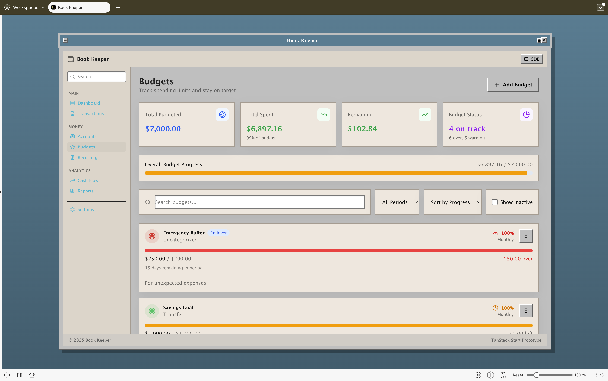
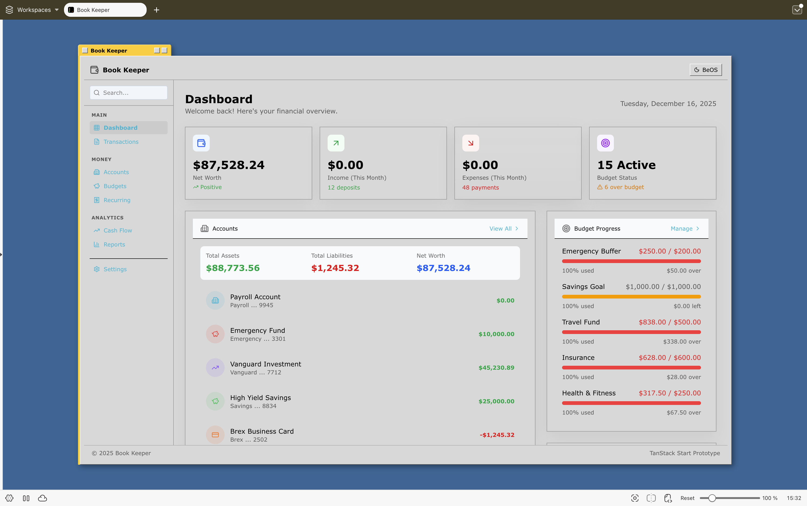
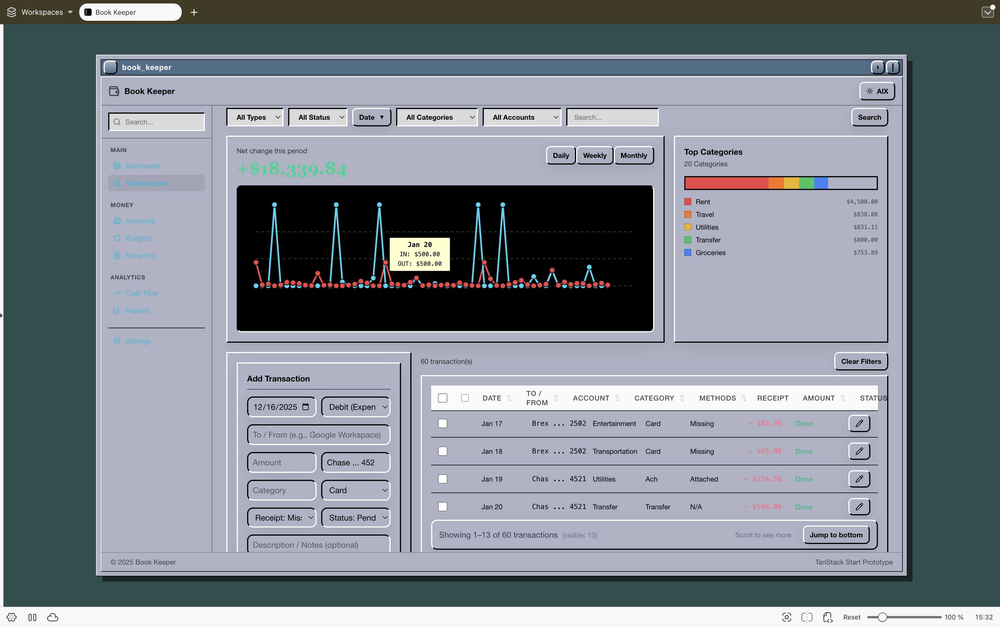
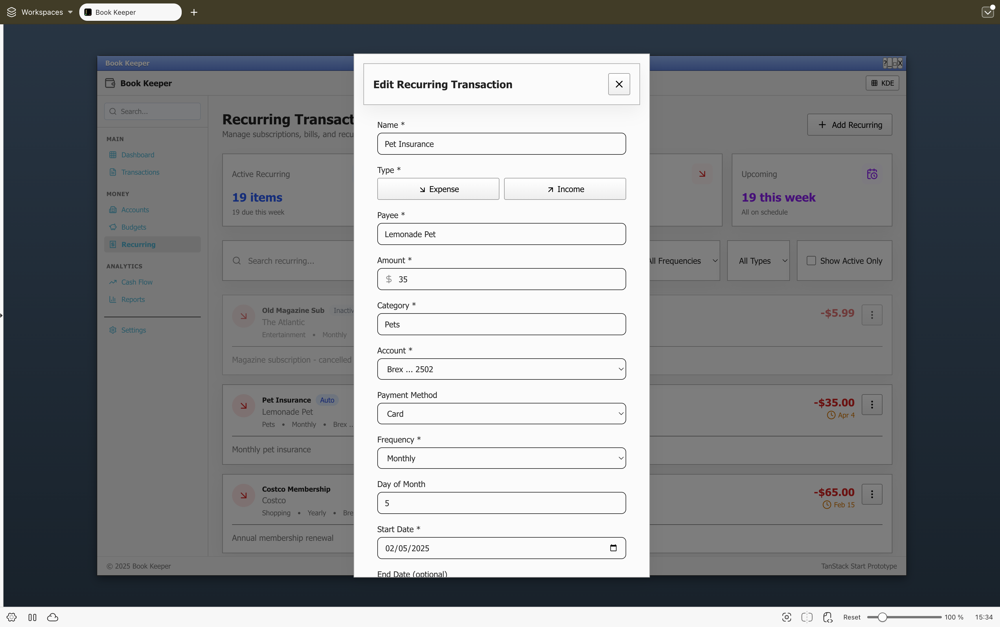

# Book Keeper (Retro Edition)

A local-first personal finance application built with **React**, **Tailwind CSS v4**, and **Tauri v2**.

It features a unique "Desktop Environment" theming engine that accurately recreates the look and feel of classic operating systems, rendering the entire application window inside a themed desktop layer.

## Themes

The app includes four pixel-perfect retro themes:

1. **CDE (Common Desktop Environment):** Solaris-style teal, serif fonts, and thick beveled panels.
2. **BeOS:** Classic yellow tabs, grey UI, and Verdana typography.
3. **AIX (Motif):** Industrial grey, sharp edges, and Helvetica fonts.
4. **KDE 3 (Plastic):** Early 2000s gradients, soft blue/grey palette, and Tahoma fonts.

## Screenshots

A 2×2 preview of the four included retro themes. Images are shown at original size from the `screenshots/` folder.

| CDE | BeOS |
| --- | --- |
|  |  |
| AIX | KDE 3 |
|  |  |

## Tech Stack

| Layer | Technology |
|-------|------------|
| **Frontend** | React 19, Tailwind CSS v4 |
| **Forms** | TanStack Form |
| **State** | Zustand (async actions) |
| **Desktop** | Tauri v2 (frameless window) |
| **Database** | SQLite (via `tauri-plugin-sql`) |
| **Web Fallback** | localStorage |
| **Icons** | Lucide React |
| **Linting** | Biome (TS/JS), Clippy (Rust) |

## Getting Started

### Prerequisites

- [Bun](https://bun.sh/) (JavaScript runtime & package manager)
- [Rust](https://rustup.rs/) (for Tauri backend)

### Installation

```bash
bun install
```

### Development

```bash
# Web mode (browser only, uses localStorage)
bun dev

# Desktop mode (Tauri + SQLite)
bun tauri:dev
```

Open http://localhost:5174 in your browser for web mode.

## Available Scripts

### Build & Quality

| Script | Description |
|--------|-------------|
| `bun run build` | Build frontend for production |
| `bun run build:all` | Full pipeline: format → lint → clippy → build |
| `bun run preview` | Preview production build locally |

### Linting & Formatting

| Script | Description |
|--------|-------------|
| `bun run format` | Format TypeScript/JavaScript with Biome |
| `bun run lint` | Lint TypeScript/JavaScript with Biome |
| `bun run check` | Run all Biome checks |
| `bun run check:unsafe` | Auto-fix with unsafe transformations |

### Rust (Tauri Backend)

| Script | Description |
|--------|-------------|
| `bun run rust:fmt` | Format Rust code with `cargo fmt` |
| `bun run rust:fmt:check` | Check Rust formatting (CI-friendly) |
| `bun run rust:clippy` | Run Clippy linter with warnings as errors |

### Tauri

| Script | Description |
|--------|-------------|
| `bun run tauri` | Run Tauri CLI commands |
| `bun run tauri:dev` | Start Tauri development mode |

## Project Structure

```
project/
├── src-tauri/                 # Rust backend (Tauri)
│   ├── src/
│   │   ├── main.rs            # App entry point
│   │   └── lib.rs             # Plugin registration
│   ├── capabilities/          # Tauri permissions
│   └── tauri.conf.json        # Window configuration
├── app/
│   ├── db/
│   │   ├── index.ts           # Database adapter factory
│   │   ├── types.ts           # Transaction types & interfaces
│   │   ├── sqlite.ts          # Tauri SQLite implementation
│   │   └── local.ts           # localStorage fallback
│   ├── lib/
│   │   └── window.ts          # Tauri window controls
│   ├── stores/
│   │   └── transactions.tsx   # Zustand store (async)
│   ├── themes/
│   │   ├── index.tsx          # ThemeProvider & useTheme
│   │   ├── kde.css
│   │   ├── aix.css
│   │   ├── beos.css
│   │   └── cde.css
│   └── routes/
│       ├── __root.tsx         # App shell & window chrome
│       ├── transactions/      # Transaction management
│       └── settings/          # Theme & data settings
├── src/
│   ├── main.tsx               # SPA router mount
│   ├── landing.tsx            # Landing page
│   └── index.css              # Tailwind entry
└── package.json
```

## Features

### Implemented

- [x] Four retro desktop themes (CDE, BeOS, AIX, KDE)
- [x] Frameless native window with themed title bars
- [x] Working window controls (minimize, maximize, close)
- [x] Transaction CRUD with TanStack Form
- [x] **Edit Transaction Modal** - Click pencil icon to edit any transaction
- [x] Interactive charts with real data (IN/OUT lines, category breakdown)
- [x] Daily/Weekly/Monthly time range toggle
- [x] Filter bar (type, status, date range, category, account, search)
- [x] Dual storage mode (SQLite in Tauri, localStorage in web)
- [x] JSON/CSV import and export
- [x] **Multiple Account Support** - Checking, savings, credit, investment accounts
- [x] **Budget Tracking** - Set budgets per category with alerts and rollover
- [x] **Recurring Transactions** - Schedule recurring payments with auto-processing

### Transaction Fields

| Field | Description |
|-------|-------------|
| Date | Transaction date |
| Type | Credit (income) or Debit (expense) |
| Payee | To/From party |
| Amount | Transaction amount |
| Account | Bank account reference |
| Category | Expense/income category |
| Method | Card, Wire, ACH, Transfer, etc. |
| Receipt | Attached, Missing, N/A |
| Status | Done, Pending, Review |

## Database Schema

```sql
CREATE TABLE transactions (
  id TEXT PRIMARY KEY,
  date TEXT NOT NULL,
  amount REAL NOT NULL,
  type TEXT NOT NULL,
  payee TEXT,
  description TEXT,
  account TEXT,
  category TEXT,
  tags TEXT,
  method TEXT,
  receipt_status TEXT,
  status TEXT DEFAULT 'pending',
  created_at TEXT,
  updated_at TEXT
);
```

## Test Data

Sample data files are provided in `test-data/` for testing:

| File | Description |
|------|-------------|
| `transactions.json` | 60 sample transactions (Jan-Mar 2025) |
| `accounts.json` | 7 sample accounts (checking, savings, credit, investment) |
| `budgets.json` | 15 budget categories with spending data |
| `recurring.json` | 20 recurring transactions (subscriptions, bills, salary) |

Import via Settings page or directly in the browser console.

## Roadmap

- [ ] TanStack Query for data fetching
- [ ] TanStack Virtual for large transaction lists (10k+ rows)
- [ ] Native file dialogs for import/export (Tauri FS)
- [ ] TanStack Router for type-safe routing
- [ ] Dashboard with account summaries
- [ ] Budget progress visualization
- [ ] Recurring transaction automation
- [ ] Reports and analytics page

## New Dependencies

| Package | Purpose |
|---------|---------|
| `@tanstack/react-form` | Form state management |
| `@tanstack/react-virtual` | Virtualized lists (installed) |
| `@tanstack/react-query` | Data fetching (installed, not yet used) |
